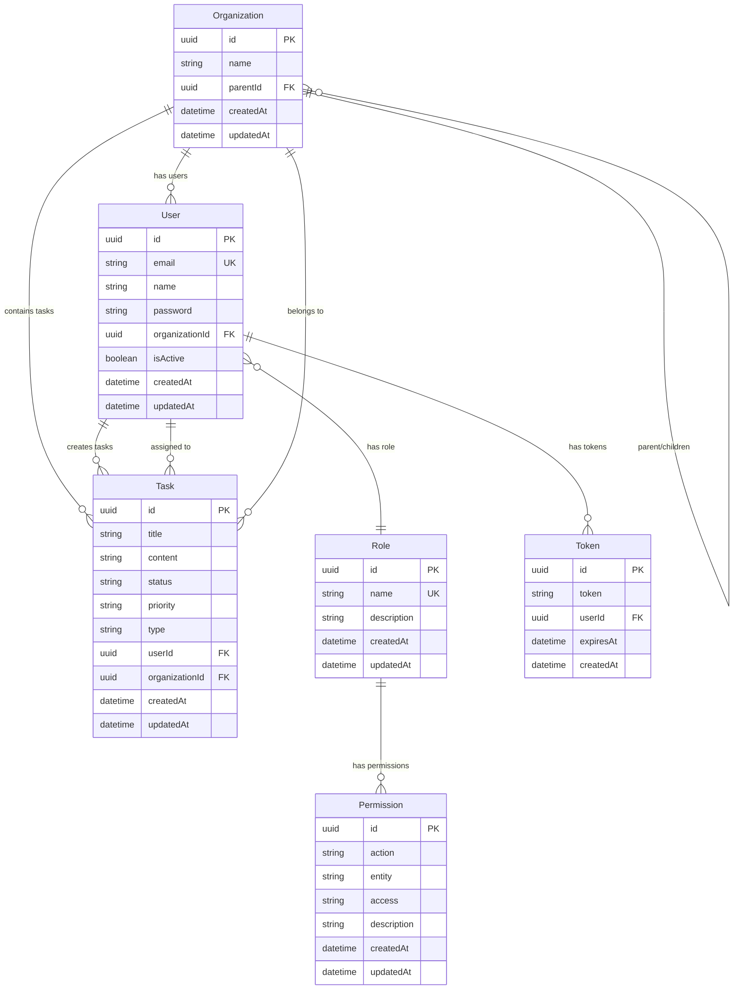

# Task Management System

A comprehensive task management application built with modern technologies, featuring role-based access control, organization hierarchy, and responsive design.

## Quick Start

### Setup Instructions

1. **Clone the repository**
   ```bash
   git clone <repository-url>
   cd task-management-system
   ```

2. **Install dependencies**
   ```bash
   npm install
   ```

   3. **Environment Configuration**
      Create a `.env` file in the root directory:
      ```env
      # Note .env not required as i have default values in the code for ease of use
   
      # Database Configuration
      DB_PATH=apps/api/data/database.sqlite
      NODE_ENV=development
   
      # JWT Configuration
      JWT_SECRET=your-super-secure-jwt-secret-at-least-256-bits-long
      JWT_EXPIRES_IN=1h
   
      # API Configuration
      API_PORT=3000
      ```

4. **Run both applications**
   ```bash

   # Backend API (NestJS)
   npm run start:api
   
   # Frontend Dashboard (Angular)
   npm run start:dashboard  
   ```

5. **Access the application**
   - Frontend: http://127.0.0.1:4200
   - Backend API: http://localhost:3000
   - API Documentation: http://localhost:3000/docs (Swagger UI)

##  Architecture Overview

### NX Monorepo Structure

This project uses [Nx](https://nx.dev) for efficient monorepo management, providing:

- **Code Sharing**: Shared libraries between frontend and backend
- **Developer Experience**: Consistent tooling and code generation
- **Scalability**: Easy addition of new applications and libraries

```
task-management-system/
├── apps/
│   ├── api/                    # NestJS Backend API
│   ├── api-e2e/               # Backend E2E tests
│   ├── dashboard/             # Angular Frontend
│   └── dashboard-e2e/         # Frontend E2E tests
├── libs/
│   ├── auth/                  # Shared authentication utilities
│   └── data/                  # Shared data models and schemas
└── tools/                     # Build and development tools
```

### Shared Libraries

#### `@task-management-system/data`
- **Zod Schemas**: Type-safe validation for API contracts
- **TypeScript Types**: Shared interfaces and types
- **Data Models**: User, Task, Organization, Role, Permission schemas

#### `@task-management-system/auth`
- **RBAC Utils**: Role-based access control utilities
- **Auth Types**: Authentication and authorization types
- **Permission Checking**: Utility functions for permission validation

### Technology Stack

**Backend (NestJS)**
- Framework: NestJS with TypeScript
- Database: SQLite with TypeORM
- Authentication: JWT with Passport
- Validation: Zod schemas with nestjs-zod
- Documentation: Swagger/OpenAPI
- Security: RBAC with custom guards and decorators

**Frontend (Angular)**
- Framework: Angular 20 with TypeScript
- State Management: NgRx Store with Signals
- UI Framework: Tailwind CSS
- Icons: Lucide Angular
- Responsive Design: Mobile-first approach

## Data Model

### Entity Relationship Diagram



### Schema Details

#### Organizations
- **Hierarchical Structure**: Support for parent-child organization relationships
- **Multi-tenancy**: Users belong to organizations, tasks are scoped to organizations
- **Flexible Hierarchy**: Unlimited nesting levels for complex organizational structures

#### Users
- **Authentication**: Email/password with JWT tokens
- **Role Assignment**: Each user has exactly one role
- **Organization Membership**: Users belong to one primary organization
- **Sub-organization Access**: Users can access their organization's sub-organizations

#### Tasks
- **Types**: `personal` (private to user) or `work` (shared within organization)
- **Status**: `todo`, `in-progress`, `done`
- **Priority**: `low`, `medium`, `high`
- **Ownership**: Tasks are owned by users and scoped to organizations

#### Roles & Permissions
- **Granular Permissions**: Action-based (`create`, `read`, `update`, `delete`)
- **Entity-specific**: Permissions apply to specific entities (`task`, `user`, `audit-log`)
- **Access Levels**: `own` (user's own resources) or `any` (organization-wide access)

## Access Control Implementation

### Role-Based Access Control (RBAC)

The system implements a comprehensive RBAC system with three predefined roles:

#### Role Definitions

**Owner**
- Full system access and administrative capabilities
- Can manage all users, tasks, and view audit logs
- Has all permissions across the organization

**Admin** 
- Administrative access with management capabilities
- Can manage tasks and users within their organization
- Can view audit logs but cannot delete users
- Limited to organization-scoped operations

**Viewer**
- Read-only access to resources
- Can view and update their own profile
- Can only see their own personal tasks and organization work tasks

#### Permission Structure

Permissions follow the format: `{action}:{entity}:{access}`

**Actions**: `create`, `read`, `update`, `delete`
**Entities**: `task`, `user`, `audit-log`
**Access Levels**: `own`, `any`

Examples:
- `read:task:own` - Read own tasks
- `update:task:any` - Update any task in organization
- `delete:user:any` - Delete any user (Owner only)

### JWT Authentication Integration

#### Authentication Flow
1. **Login**: User provides email/password
2. **Validation**: Credentials verified against database
3. **Token Generation**: JWT token created with user payload
4. **Token Storage**: Frontend stores token securely
5. **Request Authorization**: Token sent in Authorization header
6. **Token Validation**: Backend validates and extracts user info
7. **Permission Check**: RBAC guards verify user permissions

#### JWT Payload Structure
```typescript
interface JWTPayload {
  sub: string;
  id: string;
  email: string;
  role: {
    id: string;
    name: RoleName;
    permissions: Permission[];
  };
  organization: {
    id: string;
    name: string;
  };
  subOrganizations: {
    id: string;
    name: string;
  }[]
  iat: number;        // Issued at
  exp: number;        // Expires at
}
```

#### Security Implementation

**Global JWT Guard**
- Applied to all routes by default
- Validates JWT tokens on every request
- Extracts user information for authorization

**Permission Guards**
- Route-level permission checking
- Validates user permissions against required permissions
- Supports multiple permission requirements (OR logic)

**Decorators**
- `@RequirePermission()` - Specify required permissions for endpoints
- `@User()` - Inject authenticated user into route handlers
- `@Public()` - Mark routes as publicly accessible

### Task Access Control

#### Work Tasks
- **Visibility**: All users in organization can see work tasks
- **Creation**: Only Admin/Owner roles can create work tasks
- **Modification**: Based on user permissions (`own` vs `any` access)

#### Personal Tasks  
- **Visibility**: Only the task owner can see personal tasks
- **Creation**: Any authenticated user can create personal tasks
- **Modification**: Only the task owner can modify personal tasks

## API Documentation

### Base URL
- Development: `http://localhost:3000`
- Production: `https://your-domain.com/api`

### Authentication
All protected endpoints require a Bearer token in the Authorization header:
```
Authorization: Bearer <jwt-token>
```

### Core Endpoints
Prefer to use the swagger API documentation for more detailed information on each endpoint.
#### Authentication
```http
POST /auth/login
Content-Type: application/json

{
  "email": "user@example.com",
  "password": "password123"
}

Response:
{
  "access_token": "eyJhbGciOiJIUzI1NiIsInR5cCI6IkpXVCJ9...",
  "user": {
    "id": "uuid",
    "email": "user@example.com",
    "name": "John Doe",
    "role": {
      "id": "uuid",
      "name": "admin",
      "permissions": [...]
    },
    "organization": {
      "id": "uuid",
      "name": "Acme Corp"
    }
  }
}
```

```http
GET /auth/self
Authorization: Bearer <token>

Response:
{
  "id": "uuid",
  "email": "user@example.com",
  "name": "John Doe",
  "role": {...},
  "organization": {...},
  "subOrganizations": [...]
}
```

#### Tasks
```http
GET /tasks?orgId=<organization-id>
Authorization: Bearer <token>

Response:
[
  {
    "id": "uuid",
    "title": "Complete project",
    "content": "Finish the task management system",
    "status": "in-progress",
    "priority": "high",
    "type": "work",
    "userId": "uuid",
    "organizationId": "uuid",
    "createdAt": "2024-01-01T00:00:00Z",
    "updatedAt": "2024-01-01T00:00:00Z"
  }
]
```

```http
POST /tasks
Authorization: Bearer <token>
Content-Type: application/json

{
  "title": "New task",
  "content": "Task description",
  "type": "work",
  "priority": "medium"
}

Response:
{
  "id": "uuid",
  "title": "New task",
  "content": "Task description",
  "status": "todo",
  "priority": "medium",
  "type": "work",
  "userId": "uuid",
  "organizationId": "uuid",
  "createdAt": "2024-01-01T00:00:00Z",
  "updatedAt": "2024-01-01T00:00:00Z"
}
```

```http
PUT /tasks/:id
Authorization: Bearer <token>
Content-Type: application/json

{
  "status": "done",
  "priority": "low"
}

Response:
{
  "id": "uuid",
  "title": "New task",
  "content": "Task description", 
  "status": "done",
  "priority": "low",
  "type": "work",
  "userId": "uuid",
  "organizationId": "uuid",
  "createdAt": "2024-01-01T00:00:00Z",
  "updatedAt": "2024-01-01T00:00:00Z"
}
```

```http
DELETE /tasks/:id
Authorization: Bearer <token>

Response: 204 No Content
```

#### Users
```http
GET /users
Authorization: Bearer <token>
Required Permission: read:user:any

Response:
[
  {
    "id": "uuid",
    "email": "user@example.com",
    "name": "John Doe",
    "role": {...},
    "organization": {...},
    "isActive": true,
    "createdAt": "2024-01-01T00:00:00Z"
  }
]
```

#### Audit Logs
```http
GET /audit-logs
Authorization: Bearer <token>
Required Permission: read:audit-log:any

Response:
[
  {
    "id": "uuid",
    "action": "create",
    "resourceType": "task",
    "resourceId": "uuid",
    "actorUserId": "uuid",
    "actorEmail": "user@example.com",
    "organizationId": "uuid",
    "outcome": "success",
    "metadata": {},
    "createdAt": "2024-01-01T00:00:00Z"
  }
]
```

## Future Considerations

### Advanced Role Delegation
- **Dynamic Role Assignment**: Allow users to have multiple roles
- **Temporary Permissions**: Time-bound permission grants
- **Role Inheritance**: Hierarchical role structures with inheritance

### Production-Ready Security Enhancements

#### JWT Refresh Tokens
- **Implementation**: Separate access and refresh token system
- **Security**: Short-lived access tokens (15 minutes) with longer refresh tokens
- **Rotation**: Automatic token rotation on refresh
- **Revocation**: Ability to revoke refresh tokens for immediate logout

### Additional Features
- **Audit Trail Enhancement**: Detailed audit logging with search capabilities
- **API Rate Limiting**: Protect against abuse with rate limiting
- **Monitoring & Logging**: Sentry integration for error tracking
- **CI/CD Pipeline**: Automated testing and deployment pipeline

## 🛠️ Development

### Available Scripts
```bash
# Development
npm run start:api             # Run backend only
npm run start:dashboard       # Run frontend only

# Building
npm run build:api             # Build backend
npm run build:dashboard       # Build frontend

# Testing
npm run test                  # Run all tests
npm run test:api             # Run backend tests
npm run test:dashboard       # Run frontend tests
npm run e2e                  # Run E2E tests

# Code Quality
npm run lint                 # Lint all projects
npm run format               # Format code with Prettier

```

### Project Structure
```
apps/
├── api/src/app/
│   ├── modules/             # Feature modules
│   │   ├── auth/           # Authentication module
│   │   ├── users/          # User management
│   │   ├── tasks/          # Task management
│   │   ├── organizations/  # Organization management
│   │   ├── roles/          # Role management
│   │   ├── permissions/    # Permission management
│   │   └── audit-logs/     # Audit logging
│   ├── common/             # Shared utilities
│   │   ├── decorators/     # Custom decorators
│   │   ├── guards/         # Auth guards
│   │   └── filters/        # Exception filters
│   └── core/               # Core services
│       ├── database-seeder.service.ts
│       └── global-jwt-auth.guard.ts
└── dashboard/src/app/
    ├── core/               # Core services
    │   ├── services/       # Angular services
    │   ├── interceptors/   # HTTP interceptors
    │   └── guards/         # Route guards
    ├── features/           # Feature modules
    │   └── dashboard/      # Main dashboard
    ├── shared/             # Shared components
    └── store/              # NgRx store
```
